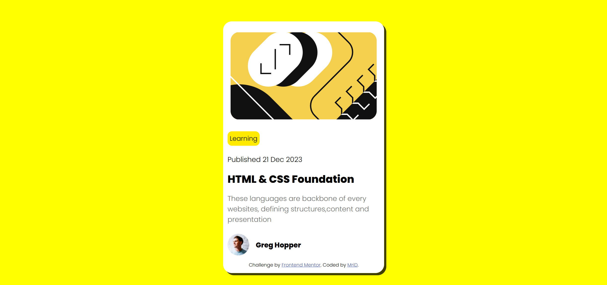

### Screenshot



### Links

- Solution URL: [https://id024.github.io/frontend-02/]

## My process
  used body to paint the background yellow, then I made make card box then centered it using body following that I added the image.
  The next step was to added text box and using flex made all the text inside with align to start, added the text then styled it

### Built with

- Semantic HTML5 markup
- CSS custom properties
- Flexbox

### What I learned

Learned to center things!
and Learned how to organize things to write less code

mainly proud of this css code!
```css
body {
  background-color: yellow;
  display: flex;
  align-items: center;
  justify-content: center;
  height: 100vh;
}
```
## Author

- Website - [MriD]
- Frontend Mentor - [@iD024](https://www.frontendmentor.io/profile/iD024)

